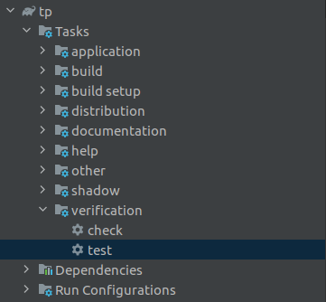
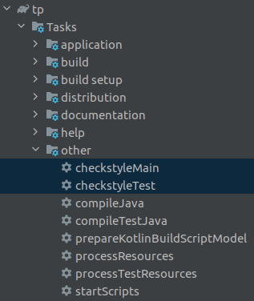

# SCRUMptious

Welcome to SCRUMptious, this is a command-line project management software, designed for project managers who adopt the SCRUM methodology.

## Setting up in Intellij

Prerequisites: JDK 11 (use the exact version), update Intellij to the most recent version.

1. **Configure Intellij for JDK 11**, as described [here](https://se-education.org/guides/tutorials/intellijJdk.html).
1. **Import the project _as a Gradle project_**, as described [here](https://se-education.org/guides/tutorials/intellijImportGradleProject.html).
1. **Verify the set up**: After the importing is complete, locate the `src/main/java/com/scrumptious/Scrumptious.java` file, right-click it, and choose `Run Scrumptious.main()`. If the setup is correct, you should see something like the below:
   ```
    > Task :compileJava UP-TO-DATE
    > Task :processResources UP-TO-DATE
    > Task :classes UP-TO-DATE
    
    > Task :Scrumptious.main()
       _____  _____ _____  _    _ __  __       _   _  
      / ____|/ ____|  __ \| |  | |  \/  |     | | (_) 
     | (___ | |    | |__) | |  | | \  / |_ __ | |_ _  ___  _   _ ___
      \___ \| |    |  _  /| |  | | |\/| | '_ \| __| |/ _ \| | | / __|
      ____) | |____| | \ \| |__| | |  | | |_) | |_| | (_) | |_| \__ \ 
     |_____/ \_____|_|  \_\\____/|_|  |_| .__/ \__|_|\___/ \__,_|___/ 
                                        | |
                                        |_|
    
    WELCOME TO SCRUMPTIOUS
    command>
   ```
   Type any command and press enter to execute the command. You can start by typing `help` first to see what commands are there, or you can refer to our user guide [here](https://ay2021s1-cs2113t-f11-4.github.io/tp/UserGuide.html).

## Build automation using Gradle

* This project uses Gradle for build automation and dependency management. It includes a basic build script as well (i.e. the `build.gradle` file).
* If you are new to Gradle, refer to the [Gradle Tutorial at se-education.org/guides](https://se-education.org/guides/tutorials/gradle.html).

## Testing

### I/O redirection tests

* To run _I/O redirection_ tests (aka _Text UI tests_), navigate to the `text-ui-test` and run the `runtest(.bat/.sh)` script.

### JUnit tests

* A skeleton JUnit test (`src/test/com/scrumptious/ScrumptiousTest.java`) is provided with this project template. 
* Other JUnit tests can be found in the same packages and can be run by **right clicking it**, then select `Run XYZTest` (where XYZ refers to the respective class name, e.g. `Project`).
* You can also run all the tests at once by running the gradle task through **Intellij IDE** or **CLI**
  * GUI
    1. Open the gradle window.
    
    1. Expand `tp>Tasks>verification`.
    
    1. Double click `test`.
  * CLI
    1. Type `./gradew clean test` and press enter.
* If you are new to JUnit, refer to the [JUnit Tutorial at se-education.org/guides](https://se-education.org/guides/tutorials/junit.html).

## Checkstyle

* A default CheckStyle rule configuration is provided in this project.
* You can run the CheckStyle by clicking `checkstyleMain` or `checkstyleMain`.
  * GUI
      1. Open the gradle window.
      
      1. Expand `tp>Tasks>verification`.
      
      1. Double click `test`.
    * CLI
      1. Type `./gradew clean test` and press enter.
* If you are new to Checkstyle, refer to the [Checkstyle Tutorial at se-education.org/guides](https://se-education.org/guides/tutorials/checkstyle.html).

## CI using GitHub Actions

The project uses [GitHub actions](https://github.com/features/actions) for CI. When you push a commit to this repo or PR against it, GitHub actions will run automatically to build and verify the code as updated by the commit/PR.

## Documentation

`/docs` folder contains a skeleton version of the project documentation.

Steps for publishing documentation to the public: 
1. If you are using this project template for an individual project, go your fork on GitHub.<br>
   If you are using this project template for a team project, go to the team fork on GitHub.
1. Click on the `settings` tab.
1. Scroll down to the `GitHub Pages` section.
1. Set the `source` as `master branch /docs folder`.
1. Optionally, use the `choose a theme` button to choose a theme for your documentation.