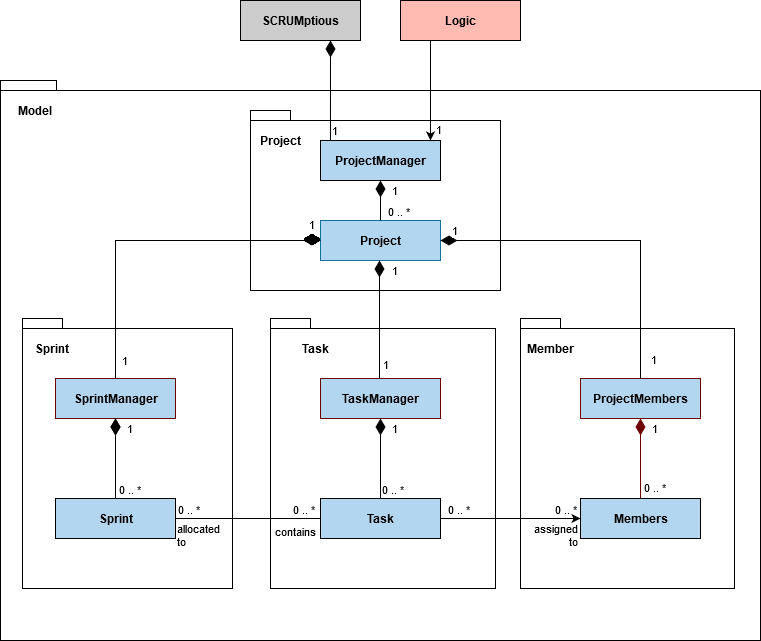
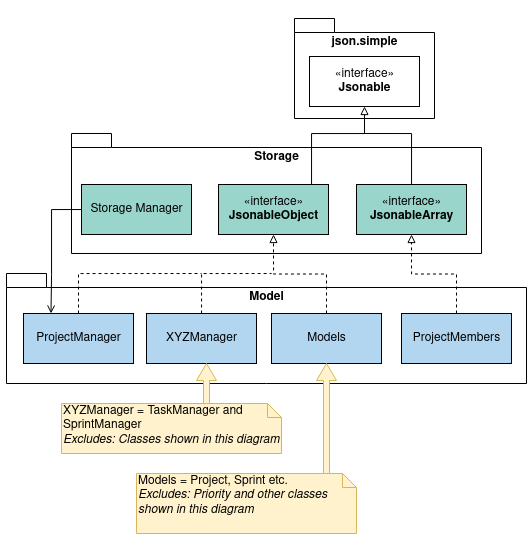

# Developer Guide

## Table of Contents
1. [Introduction](#introduction)
    1. [Background](#background)
    1. [Purpose](#purpose)
    1. [Scope](#scope)
1. [Getting Started](#getting-started)
    1. [Prerequisites](#prerequisites)
    1. [Setting Up](#setting-up)
    1. [Running the Program](#running-the-program)
1. [Design](#design)
    1. [Architecture](#architecture)
    1. [UI Component](#ui-component)
    1. [Logic Component](#logic-component)
    1. [Model Component](#model-component)
    1. [Storage Component](#storage-component)
1. [Implementation](#implementation)
    1. [Project](#project)
        1. [Create Project](#create-project)
        1. [Select Project](#select-project)
    1. [Task](#task)
        1. [Add Task](#add-task)
        1. [View Task](#view-task)
        1. [Delete Task](#delete-task)
        1. [Change Task Priority](#change-task-priority)
        1. [Mark Task as Complete](#mark-task-as-complete)
    1. [Sprint](#sprint)
        1. [Create Sprint](#create-sprint)
        1. [View Sprint](#view-sprint)
        1. [Add Task to Sprint](#add-task-to-sprint)
        1. [Remove Task from Sprint](#remove-task-from-sprint)
        1. [Allocate Sprint Tasks to Members](#allocate-sprint-tasks-to-members)        
    1. [Saving of Data](#saving-of-data)
1. [Others](#target-user-profile)

## Introduction
### Background
SCRUMptious is a Java-based command line interface application for you to efficiently manage the development of a project. Leveraging the robust SCRUM/Agile framework, it allows you to delegate tasks to your team members and organize project requirements with ease. As a bonus, if you are a keyboard warrior, you can reach peak efficiency using SCRUMptious to manage your projects.

### Purpose
This guide illustrates the general architecture, and software design of SCRUMptious.

### Scope
This guide is geared towards developers who wish to enhance or create their own version of SCRUMptious. As such, it contains important information regarding the software architecture and design considerations of SCRUMptious.

## Getting Started
### Prerequisites
1. JDK 11.
1. IntelliJ IDEA.

### Setting Up
1. Use a Git tool to fork this repository, or download the .zip file from GitHub and extract the contents into a new folder.
1. Right-Click on the folder and select “Open folder as Intellij IDEA Community Edition Project”.
1. Ensure JDK 11 is selected for Gradle, by navigating to Configure > Structure for New Projects > Project Settings > Project > Project SDK.

### Running the Program
This program can be run once it is compiled. If you have built its artifacts (.jar) file, you may run it using java -jar <filename.jar> on your command line.

## Design
### Architecture
{UML}
### UI Component
{UML}
### Logic Component
{UML}
### Model Component
  
Link: [Model Package](https://github.com/AY2021S1-CS2113T-F11-4/tp/tree/master/src/main/java/seedu/duke/model)  
The Model
* Includes four packages namely, Project, Task, Member and Sprint.

Project package
* Includes a ProjectList to manage the multiple instances of Project created by the user
* Each instance of Project stores one instance of ProjectBacklog, ProjectMembers and SprintList.

Task  package
* Includes a ProjectBacklog to manage every Tasks created by the user
* Task can be allocated to Sprints and can be assigned to Members, 

Member package
* Includes a ProjectMembers to manage every Members created by the user
* Member can be assigned with Tasks and can be allocated to Sprints holding those Tasks
 
Sprint package
* Includes a SprintList to manage every Sprints created by the user
* Sprint can contain Tasks and Members allocated to those Tasks
### Storage Component
  
  
API: [StorageManager.java](/src/main/java/seedu/duke/storage/StorageManager.java)  
The Storage component is using the JavaScript Object Notation (JSON) to save the data. The library used for serialising and deserializing the data is _json.simple 3.1.1_ by **Clifton Labs**.  
As shown in the diagram above, `JsonableObject` and `JsonableArray` are interfaces which inherits the `Jsonable` interface. The following model class inherits only one of the two interfaces:  
- ProjectManager  
- Project  
- SprintManager  
- TaskManager  
- ProjectMembers  
- Sprint  
- Task  
- Member  

This requires the model classes to implement two methods required for JSON serialisation and deserialisation:  
- `toJson()`: Contains logic required to convert the model object into JSON string.  
- `fromJson()`: Contains logic required to convert JSON object into its respective model class.  
  - Due to the limitations of the library, parsing of the JSON string only converts it into either `JsonObject` or `JsonArray` objects which requires additional operations to map the data back to the respective model classes.  
  - `fromJson()` will take in either one of the `JsonObject` or `JsonArray` object, and map the properties to the respective properties of the model classes.  

## Implementation
### Project
#### Create Project
#### Select Project
### Task
#### Add Task
#### View Task
#### Delete Task
#### Change Task Priority
#### Mark Task as Complete    
### Sprint
In SCRUMptious, a Project will be broken down into smaller iterations known as Sprints. The Sprint will contain information about the Tasks allocated for that iteration and Members that are assigned to complete the Tasks.

The following section will explain how the management of Sprints is implemented in the program.

#### Create Sprint

  
  
Link: [CreateSprintCommand.java](/src/main/java/seedu/duke/command/sprint/CreateSprintCommand.java) 

A Sprint can be created when there is an existing Project.
When the Project is created, the duration of the Project and length of the Sprints are specified, thus, there will be a finite number of Sprints for each Project.

Before execution:
1. Parse user input into Command

    SCRUMptious will receive user input using the `Ui` class and parse it into `CreateSprintCommand` with `Parser` and `SprintParser`.
1. Execute CreateSprintCommand

    SCRUMptious calls `Command.execute()` which will execute the command as mentioned in the implementation.

Implementation:
1. Choose the Project to add the new Sprint

    `chooseProject()` will be called to check for the optional `-project` tag in the user specified parameters.
    
    Note: If the tag is not specified, the default Project in the ProjectManager indexed by `selectedProject` will be chosen.
1. Prepare parameters
    
    `prepareParameters()` will be called to check for the mandatory `-goal` tag in the user specified parameters.
    In addition, It will also prepare the optional `-start` tag as required in the following two scenarios:
    1. New Sprint is first Sprint in Project
        
        Being the first Sprint in the Project, the `-start` tag will determine the start date for both the new Sprint and Project.
        Thus, the `String` parameter will be sent to _DateTimeParser_ via `parseDate()` to parse it into a _LocalDate_ object.
        
        The end date for the Project and Sprint will also be determined by adding `projectDuration` and `sprintLength` to the start date respectively.
        
    1. New Sprint is not first Sprint in Project
    
        As there is a previous Sprint before the newly created Sprint, the new Sprint will start the day after the previous 
        Sprint ends. Thus, the `-start` tag will be ignored even if specified by user.

1. Check all sprint created

    With all the necessary parameters prepared, the command will check if there is still room to add new Sprint by checking
    if the prepared `sprintEndDate` is after the `projectEndDate`.
    
    Note: This check is done after the `prepareParameters()` as the _LocalDate_ `sprintEndDate` is required.
    
1. Update Project Start and End date if new Sprint is first Sprint

    As mentioned above, if the new Sprint is the first Sprint in the Project, the `-start` tag will determine the start and end date of the Project.
1. Add Sprint to Sprint Manger
    
    `addSprint()` is finally called to add a new Sprint to the Sprint Manager.
   
1. Output to User
    
    `printCreatedSprint()` is then called to output the newly created Sprint in `createdSprint.toString` via `Ui.showToUserLn()`

#### View Sprint

Link: [ViewSprintCommand.java](/src/main/java/seedu/duke/command/sprint/ViewSprintCommand.java) 

A Sprint can only be viewed when there is an existing Sprint. When the user request to view the sprint, the Sprint number is specified and the program will output the information about the Sprint corresponding to the Sprint number.

Prerequisites:    
1. At least one Sprint in the SprintList

Implementation:
1. UI receive user input
1. Parser parse user input
1. Execute ViewSprintCommand
    1. Get Sprint from SprintList
    1. UI output to user

#### Add Task to Sprint

Link: [AddSprintTaskCommand.java](/src/main/java/seedu/duke/command/sprint/AddSprintTaskCommand.java) 

Users can add Tasks existing in the Project Backlog to the Sprint, indicating that the Tasks are to be worked on during the iteration. 

Prerequisites:    
1. At least one Sprint in the SprintList
1. At least one Task in the ProjectBacklog

Implementation:
1. UI receive user input
1. Parser parse user input
1. Execute AddSprintTaskCommand
    1. On Sprint 
        1. Add Task ID into sprintTaskIds
    1. On Task
        1. Add Sprint Number into sprintAllocatedTo
    1. UI output to user

#### Remove Task from Sprint

Link: [RemoveSprintTaskCommand.java](/src/main/java/seedu/duke/command/sprint/RemoveSprintTaskCommand.java) 

Users can remove Tasks from Sprint, indicating that the Tasks are deemed to not be worked on during the iteration. 

Prerequisites:    
1. At least one Sprint in the SprintList
1. At least one Task is added to the selected Sprint

Implementation:
1. UI receive user input
1. Parser parse user input
1. Execute RemoveSprintTaskCommand
    1. On Sprint 
        1. Remove Task ID from sprintTaskIds
    1. On Task
        1. Remove Sprint Number from sprintAllocatedTo
    1. UI output to user

#### Allocate Sprint Tasks to Members   

Link: [AllocateSprintTaskCommand.java](/src/main/java/seedu/duke/command/sprint/AllocateSprintTaskCommand.java) 
 
Users can allocate Sprint Tasks to Members, indicating that the Tasks are assigned to the selected member to work on during the iteration. 

Prerequisites:    
1. At least one Task is added to the selected Sprint
1. At least one Member is added to the Project

Implementation:
1. UI receive user input
1. Parser parse user input
1. Execute AllocateSprintTaskCommand
    1. On Task
        1. Add Member ID into membersAllocatedTo
    1. On Member
        1. Add Task ID into allocatedTaskIds

### Saving of Data
To make the data persistent and portable, **JSON** has been chosen as the format for data to be saved to a persistent storage such as storage drives, thumb drives and any other storage medium that is used to run the program. JSON is also human-readable which allows users to directly modify the data file easily which can be useful in certain scenarios such as fixing the data file in the event of data corruption.

  
_Figure X: Running the Jar_  
  
_Figure X: Running in IDE_  

As shown in the above diagram, the program will save the data as “data.json”. The data file is saved in the “data/” folder that is located in the folder of the program. If you are testing the program using Intellij IDE, the “data/” folder will be in the root of the project folder. 
  
When you start the program, the program will load the data file from its respective location and deserialise it into its respective object instances. Data will be saved when the program exits or whenever the user makes changes to the program.  

### Target user profile

{Describe the target user profile}

### Value proposition

{Describe the value proposition: what problem does it solve?}

## User Stories

|Version| As a ... | I want to ... | So that I can ...|
|--------|----------|---------------|------------------|
|v1.0|new user|see usage instructions|refer to them when I forget how to use the application|
|v2.0|user|find a to-do item by name|locate a to-do without having to go through the entire list|

## Non-Functional Requirements

{Give non-functional requirements}

## Glossary

* *glossary item* - Definition

## Instructions for manual testing

{Give instructions on how to do a manual product testing e.g., how to load sample data to be used for testing}
